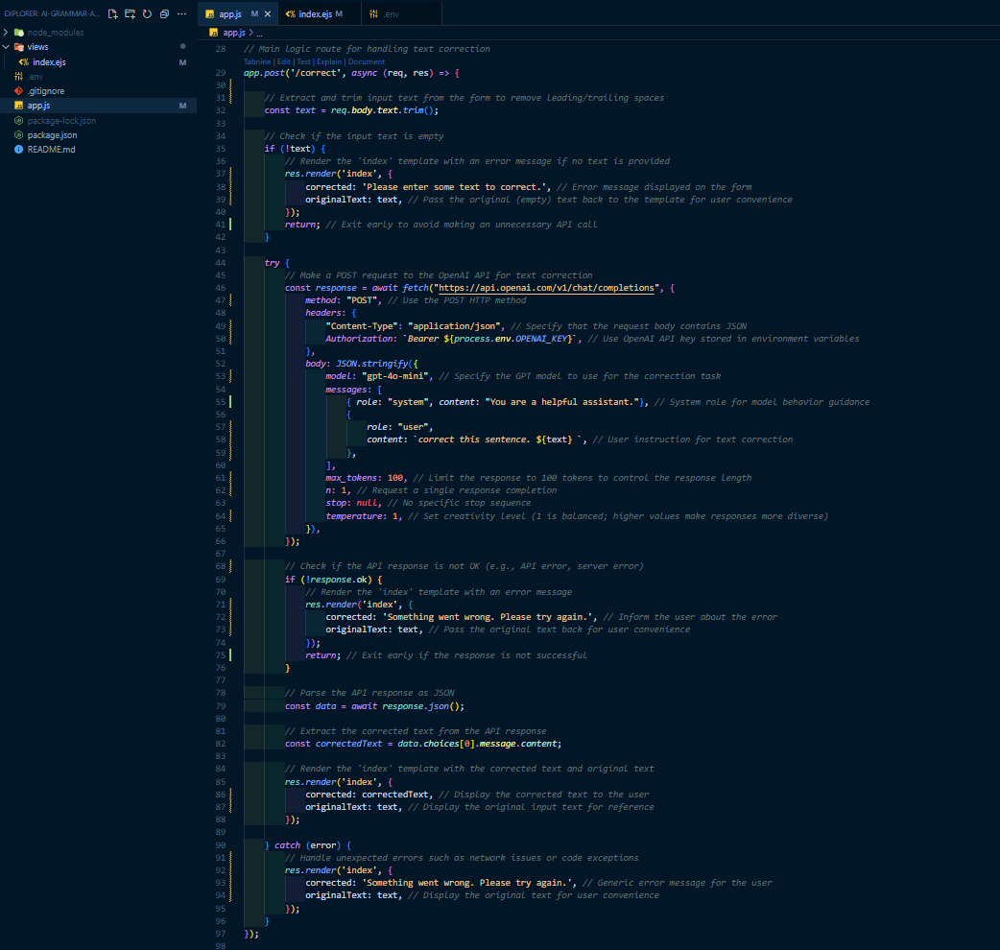

# AI Grammar Corrector App

Welcome to the AI Grammar Corrector App! This application leverages artificial intelligence to identify and correct grammatical errors in English text, enhancing the clarity and professionalism of your writing.

## Features

- **Grammar Correction**: Automatically detects and corrects grammatical errors in your text.
- **Spell Check**: Identifies and corrects spelling mistakes to ensure accuracy.
- **Punctuation Check**: Reviews and corrects punctuation usage for improved readability.

## Installation

To set up the AI Grammar Corrector App locally, follow these steps:

1. **Clone the Repository**:
   ```bash
   git clone https://github.com/MalingaBandara/AI-Grammar-APP.git
   cd AI-Grammar-APP
   ```

2. **Install Dependencies**:
   Ensure you have [Node.js](https://nodejs.org/) installed. Then, run:
   ```bash
   npm install
   ```

3. **Start the Application**:
   ```bash
   node app.js
   ```

   The application will be accessible at `http://localhost:3000`.

## Usage

1. **Input Text**: Enter the text you wish to analyze into the input field.
2. **Submit**: Click the "Check Grammar" button to process the text.
3. **Review Corrections**: The app will display the corrected text along with suggestions for improvement.

## Screenshots
<br>
*Example of the application's code structure.*
  

<br>
*Sample output after processing text.*
  

<br>
*Another example of the application's output.*
  


## Technologies Used

- **JavaScript**: Core programming language for the application logic.
- **EJS (Embedded JavaScript)**: Templating engine for rendering HTML pages.
- **Node.js**: JavaScript runtime environment for server-side execution.

## Contributing

We welcome contributions to enhance the AI Grammar Corrector App. To contribute:

1. Fork the repository.
2. Create a new branch: `git checkout -b feature-branch-name`.
3. Make your changes and commit them: `git commit -m 'Add new feature'`.
4. Push to the branch: `git push origin feature-branch-name`.
5. Open a Pull Request detailing your changes.

## License

This project is licensed under the MIT License. See the [LICENSE](LICENSE) file for more details.

## Contact

For questions or suggestions, please open an issue in this repository or contact the project maintainer.

---

*Note: This application is a project by [MalingaBandara](https://github.com/MalingaBandara).*

